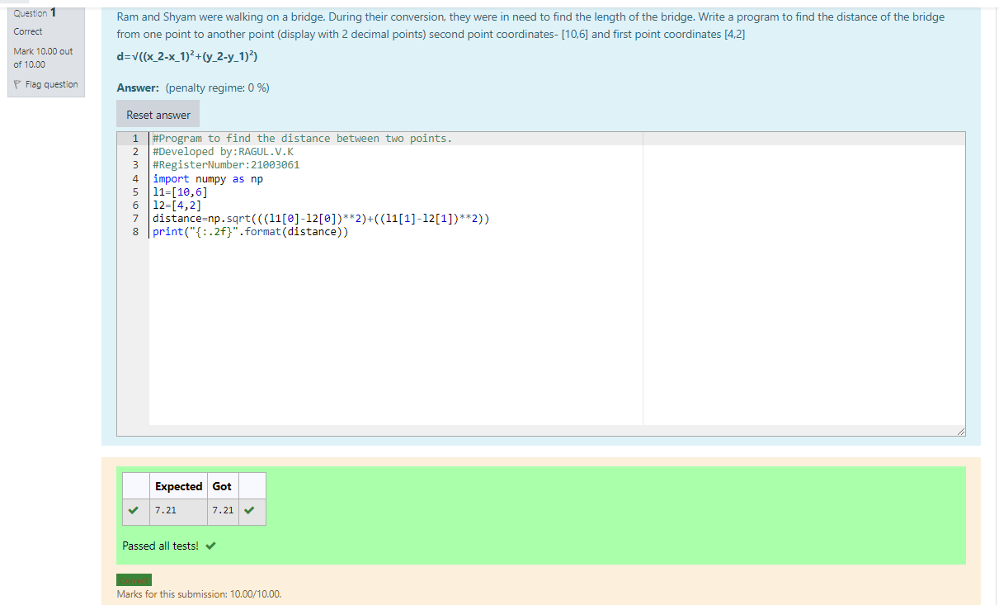

# DISTANCE-BETWEEN-TWO-POINTS
## AIM:
To write a python program to find the distance two 2 points
## ALGORITHM:
### Step 1: 
Import numpy into the editor
### Step 2:
Input the co-ordinates to calculate the distance between them 
### Step 3: 
Substitute the values in the distance formula  

### Step 4: 
Print the solution.
### Step 5: 
End the Program.
### PROGRAM:
~~~
#Program to find the distance between two points.
#Developed by:RAGUL.V.K 
#RegisterNumber:21003061
import numpy as np
l1=[10,6]
l2=[4,2]
distance=np.sqrt(((l1[0]-l2[0])**2)+((l1[1]-l2[1])**2))
print("{:.2f}".format(distance))
~~~
### OUTPUT:

### RESULT:
The distance between the two points is displayed successfully.